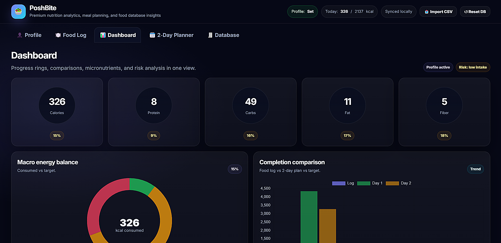

# 🥗 PoshBite

**Smart Nutrition. Better Choices.**



PoshBite is a nutrition analytics dashboard that helps users track food intake, analyze macro and micronutrients, identify nutritional deficiencies, and generate personalized meal recommendations using a CSV-driven nutrition database.

Built as a fully client-side web application, PoshBite combines nutrition tracking, food intelligence, meal planning, and visual analytics into a clean and responsive dashboard experience.

---

## ✨ Features

### 👤 Profile & Nutrition Targets

* Age, gender, height, weight, and activity level inputs
* Personalized calorie and macronutrient targets
* Goal-based nutrition planning
* Dietary preference support
* Dynamic target calculations

### 🍽️ Food Logging

* Search and log foods from the nutrition database
* Quantity-based nutrition calculations
* Editable food entries
* Quick nutrition preview
* Daily intake tracking

### 📊 Nutrition Analytics Dashboard

* Calorie tracking
* Protein, carbohydrate, fat, and fiber monitoring
* Progress indicators
* Macro balance visualization
* Daily nutrition insights

### 🔬 Micronutrient Analysis

Track key micronutrients including:

* Iron
* Calcium
* Vitamin C
* Vitamin D
* Vitamin B12
* Magnesium
* Potassium
* Zinc
* Folate
* Sodium

### ⚠️ Risk & Deficiency Analysis

* Nutrient deficiency detection
* Excess nutrient monitoring
* Nutrition gap analysis
* Personalized health insights
* Severity-based recommendations

### 🧠 Smart Recommendations

* Food additions
* Food swaps
* Portion adjustment suggestions
* Diet-aware recommendations
* Nutrient-focused guidance

### 📅 2-Day Meal Planner

* Automatically generated meal plans
* Breakfast, lunch, dinner, and snack suggestions
* Profile-based recommendations
* Balanced nutrition planning

### 🗂️ CSV Nutrition Database

* Import nutrition datasets using CSV
* Search and filter foods
* Category-based browsing
* Nutrition data exploration
* Dynamic food database integration

### 📈 Visual Analytics

* Interactive charts
* Progress rings
* Macro comparison views
* Nutrition completion tracking
* Dashboard KPI cards

### 📱 Fully Responsive

Optimized for:

* Mobile Devices
* Tablets
* Laptops
* Desktop Screens

---

## 🛠️ Tech Stack

* HTML5
* CSS3
* JavaScript (Vanilla JS)
* Chart.js

No backend required.

No frameworks required.

Runs entirely in the browser.

---

## 🚀 Getting Started

### 1. Clone the Repository

```bash
git clone <repository-url>
```

### 2. Open the Project

Simply open:

```text
index.html
```

in your browser.

No installation or build process required.

---

## 📂 Project Structure

```text
/
├── index.html
├── foods-database.csv
├── screenshots/
└── README.md
```

---

## 📸 Screenshots

### Dashboard

Nutrition overview, progress tracking, and analytics.

### Food Log

Search, add, and manage daily food intake.

### Meal Planner

Automatically generated 2-day meal recommendations.

### Food Database

Searchable nutrition database with filtering and sorting.

### Profile & Targets

Personalized nutrition goals and target calculations.

---

## 🎯 Key Learning Outcomes

This project was built using an iterative AI-assisted development workflow.

Major learnings include:

* Building MVPs before adding complexity
* CSV-driven application architecture
* Nutrition data modeling
* Dashboard UI/UX design
* Data visualization with Chart.js
* Responsive front-end development
* AI-assisted product enhancement workflows

---

## 🔮 Future Improvements

* Weekly nutrition reports
* PDF export support
* User authentication
* Cloud data synchronization
* AI-powered meal generation
* Advanced nutrition scoring

---

## 📄 License

This project is intended for educational and portfolio purposes.

---

### Built with ❤️ as part of an AI-assisted product development journey.
